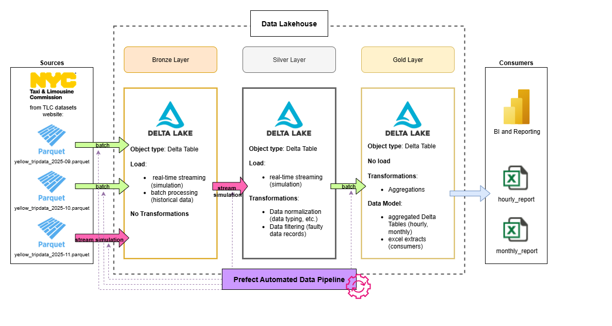

# NYC Taxi Medallion Data Pipeline 🚖


## 1. Description
This project is an **End-to-End Data Engineering Pipeline** for NYC Yellow Taxi trip data. The system is built as a **Lakehouse with Delta Tables**  utilizing the Medallion Architecture (Bronze, Silver, Gold) to ensure data consistency and performance.

The source of the data is website: https://www.nyc.gov/site/tlc/about/tlc-trip-record-data.page

It features a hybrid ingestion strategy, combining **Batch processing** for historical Parquet files and **Real-time Streaming** via Kafka for current records (simulation of loading latest records as live). The solution is fully containerized and automated to handle data cleaning, unification, and transformation.

## 2. Technological Stack
* **Languages:** Python 3.11
* **Data Processing:** Apache Spark 3.5 (PySpark)
* **Storage Format:** Delta Lake (providing ACID transactions and scalable storage)
* **Message Broker:** Apache Kafka (Confluent Platform) for real-time data simulation
* **Orchestration:** Prefect 2.0 (Automated scheduling, monitoring, and error handling)
* **Containerization:** Docker & Docker Compose
* **Key Libraries:** * `pyspark` & `delta-spark` (Core processing engine)
    * `confluent-kafka` (Streaming data producer)
    * `prefect` & `docker-py` (Orchestration and cross-container control)
    * `pandas` & `openpyxl` (Reporting and Excel generation)

## 3. Data Architecture & Pipeline Flow
The project implements a classic Medallion Architecture to transform raw data into insights:
* **Bronze:** Raw data ingestion from Parquet (Batch) and Kafka (Stream) into Delta tables with minimal transformation.
* **Silver:** Data cleaning, filtering (removing trips with zero distance/fare), and schema unification to handle different source formats.
* **Gold:** High-level business aggregations (Hourly and Monthly statistics) exported to Delta and Excel reports.



## 4. Project Setup

Follow these steps to set up the local environment and launch the infrastructure:

### Initialize Virtual Environment
```bash
# Create the virtual environment
python -m venv .NYC_Taxi_venv

# Activate the environment
.NYC_Taxi_venv\Scripts\activate      # - Windows
# OR
source .NYC_Taxi_venv/bin/activate   # - Linux/MacOs

# Install required libraries
pip install -r requirements.txt
```
### Lunch infrastructure
```bash
# Verify Docker is responsive
docker info

# go to docker directory
cd docker

# Clean up previous states (optional)
docker-compose down -v

# Start the entire stack (Kafka, Spark, Delta Lakehouse)
docker-compose up -d
```

## 5. Containers Architecture
The project is divided into specialized services communicating via the `lakehouse-net` network:

* **`kafka (NYC_Taxi)`**: The message broker that handles the real-time stream of taxi records.
* **`nyc-producer`**: A Python service that reads November 2025 data and streams it to Kafka, simulating live traffic.
* **`spark-master`**: The coordinator of the Spark cluster, managing resource allocation.
* **`spark-worker`**: The execution unit where all heavy PySpark jobs (Batch and Stream) are performed.
* **`prefect-server`**: Provides the UI (available at `localhost:4200`) and the API for monitoring flow runs.
* **`prefect-orchestrator`**: The "brain" of the pipeline. It hosts the Prefect worker that triggers Spark jobs inside the `spark-worker` container via `docker.sock` and manages the execution schedule (CRON).

## 6. About Me
Hello friends, I hope you enjoyed my next project I made to learn new DE technologies. I wish you a great day!
